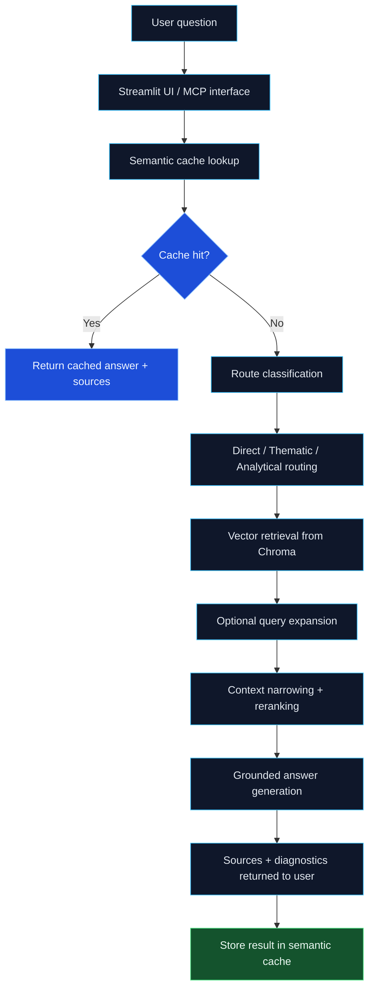

# Project Update: Tesla Financial Report RAG Assistant

## Status: Core POC is implemented and operational

This project has moved beyond the initial concept phase and is now functioning as a local Python-based RAG prototype focused on a Tesla financial report. The workspace includes a Streamlit frontend, a semantic cache, a local vector store, a route-based retrieval flow, and an MCP server interface.

The project is intentionally lightweight and designed to run locally without enterprise infrastructure. It is best understood as a working demonstration of grounded question answering over a single financial report document, not as a production-ready platform.

---

## 1. Objective

The project exists to answer user questions about the Tesla financial report using evidence from the report itself rather than external knowledge.

The system is designed to:

- accept a natural-language question;
- classify the question into a retrieval route;
- check whether a similar question was already answered;
- retrieve the most relevant report passages;
- optionally expand or rerank results;
- generate a grounded answer; and
- return source references and pipeline diagnostics to the user.

---

## 2. Current implementation summary

The current codebase includes the following components:

### Frontend
- Streamlit application in `app.py`
- dark themed UI with example questions and recent-question history
- answer display, source list, and RAG diagnostics panel

### Core pipeline
- `src/pipeline.py` orchestrates the end-to-end request flow
- question embedding is generated using SentenceTransformers
- semantic cache is checked before full retrieval
- route classification is derived through the query router
- retrieval is performed against a persistent Chroma vector store
- contextual chunks are surfaced back to the answer-generation layer

### Semantic cache
- implemented in `src/cache/semantic_cache.py`
- cosine similarity lookup with TTL-based expiry
- stores question, answer, route, and source metadata
- supports cache hit/miss visibility in UI diagnostics

### Retrieval and routing
- route-based logic in `src/routing/query_router.py`
- retrieval layer in `src/retrieval/retriever.py`
- query expansion and context selection are configured through settings
- final answer generation uses a grounded fallback response when a full LLM-backed answer is not available

### Generation fallback
- `src/generation/fallback_generator.py` produces a grounded answer from retrieved chunks
- this allows the project to remain usable in smoke-test scenarios without a configured Groq key

### MCP server
- `mcp_server.py` exposes the RAG pipeline through FastMCP
- supports HTTP streamable transport and stdio mode
- includes a root redirect to the MCP endpoint for HTTP usage

### Tests
- `tests/test_semantic_cache.py` covers cache hit/miss behavior
- `tests/test_mcp_server_http.py` validates the HTTP redirect behavior

---

## 3. Current architecture

The system uses:

- Python
- Streamlit
- SentenceTransformers
- ChromaDB
- FastMCP
- local configuration via `.env`

---

## 4. Delivered capability status

| Area | Status | Notes |
|---|---|---|
| Streamlit app | Completed | runs locally with a clean UI |
| Semantic cache | Completed | in-memory similarity lookup with TTL |
| Vector store | Completed | local persistent ChromaDB under `chroma_db/` |
| Query routing | Completed | direct / thematic / analytical flow pattern |
| Retrieval pipeline | Completed | corpus lookup from local report chunks |
| Source attribution | Completed | page references are included in sources |
| MCP interface | Completed | HTTP and stdio transports supported |
| Fallback grounded answer | Completed | works without Groq config |
| Automated tests | Partially complete | cache and MCP HTTP smoke tests exist |
| Groq integration | Configured but optional | project supports Groq when keys are set |

---

## 5. Current assumptions and constraints

The project is intentionally scoped to a local demo environment:

- single-document retrieval only
- no application database
- no user auth or multi-user layer
- no production observability stack
- CPU-only execution preferred
- grounded answers are expected to remain anchored to the Tesla report

This is not intended to become a multi-tenant enterprise RAG platform. It is a clear implementation of a local evidence-grounded document assistant.

---

## 6. Operational notes

### Configuration
- runtime configuration is handled through environment variables in `src/config.py`
- defaults include the embedding model, collection name, chunking values, cache threshold, and route settings

### Data directory
- the app expects a PDF in the data path configured by `PDF_PATH`
- Chroma persistence is kept under the project-level `chroma_db/` folder

### Behavior without Groq
- if no Groq key is available, the app falls back to a grounded local answer mode for smoke testing
- this preserves a usable app experience while keeping the project honest about evidence-based answer generation

---

## 7. Project health and gaps

The current project is strong in structure and demonstrability, but a few gaps remain before it is considered fully productionized:

- stronger chunk indexing validation for PDF page metadata
- deeper route-quality evaluation across representative questions
- optional reranker quality tuning for more relevant context selection
- more formal tests around retrieval quality and route accuracy
- a fuller Groq-backed generation flow with prompt tuning and answer evaluation

---

## 8. Near-term roadmap

### Phase 1: Stabilization
- confirm the indexing pipeline on the actual PDF file
- verify chunk metadata and route outputs on representative queries
- finalize environment configuration and setup flow

### Phase 2: Quality improvement
- improve retrieval relevance through better chunking and query expansion tuning
- validate direct / thematic / analytical route quality against sample questions
- tighten source attribution and answer grounding behavior

### Phase 3: Integration polish
- add stronger evaluation around answer quality and consistency
- keep Groq as an optional provider while the local fallback remains reliable
- refine the UI diagnostics so the retrieval process is easy to explain

### Phase 4: Expansion options
- support multiple documents or document collections
- evaluate hybrid retrieval strategies
- improve persistent cache and operational observability

---

## 9. Definition of done for this project phase

This project milestone should be considered successful when the following are true:

- the app can run locally from the workspace environment;
- the user can ask questions about the Tesla report and receive grounded answers;
- route, cache, and source metadata are visible to the user;
- the project works with or without Groq depending on configuration;
- the local vector store, retrieval flow, and MCP entrypoints remain stable;
- the codebase remains simple enough to explain and iterate on quickly.

---

## 10. Final project update

The Tesla Financial Report RAG project is now in a working demonstration phase. The core capabilities are implemented and the workspace reflects a viable local RAG architecture with an accessible UI, grounded answer path, semantic caching, route-driven retrieval, and MCP integration. The project is positioned as a practical local prototype rather than a production platform, and the next step is refinement, validation, and quality tuning around retrieval behavior and answer consistency.
